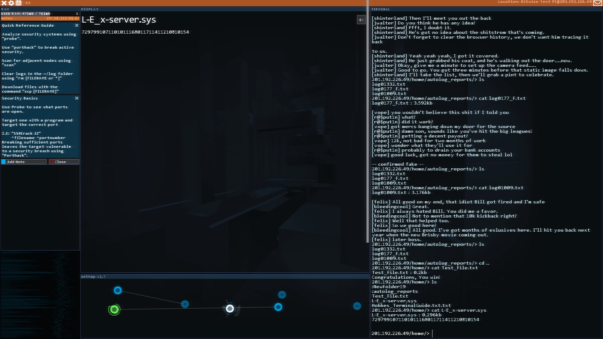
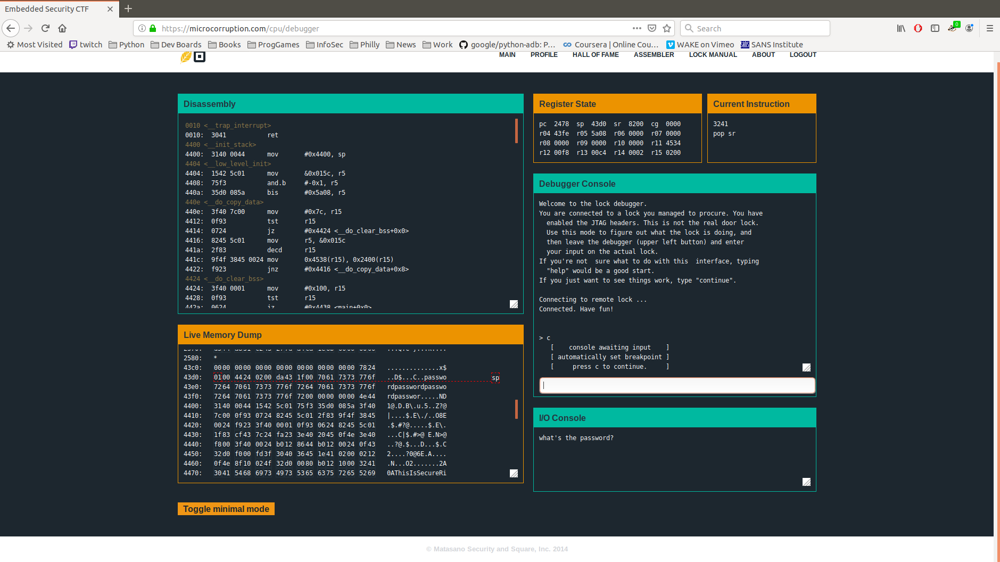

## SECURITY IS NOT A GAME (THE GAME)
### from Tron to DefCon in 45 minutes

##### Rachel Rawlings

---

### Let's say it started with TRON


In the movie and the game, Flynn encodes a disk with the data he needs to bypass the Master Control Program and has to find a way to exfiltrate it.

We never get to see how he encodes the data or breaks the MCP with code. He just throws a frisbee a lot.


---
### Push Button, Get Hack

This abstraction continued through thirty years of cyberpunk games from Neuromancer (1988) through the Deus Ex series including the latest release, Mankind Divided.


---
### Moar Please

* More recently, hacking games like Hacknet, Hack'n'Slash, Else Heart.Break(), and Exapunks, have focused on actually chaging code within the game
---
#### Hack'n'Slash
* Zelda-like adventure where your sword is a USB device.
* Anything with a port can be tweaked.
* Adjust variables to change object behaviors.


---
#### Hacknet
* Story-driven through email, simplified penetration testing
* Lots of easter eggs like #TalesFromIRC
* Uses some actual Linux/DOS commands (ls|dir, man, scp)  and scripts like SSHcrack




---
#### Else Heart.Break()
* Acquire a Modifier and change the code of street lights, network junctions, even beer!
* In-game language called Språk has developed a small community on github.


---
#### Zachtronics games
* Three different programming games that use assembly: TIS-100, Shenzhen I/O, and EXAPUNKS
* In Steam versions, your solutions are ranked against other players'.
---
#### Exapunks
* You're sick with "the Phage." Hack or die.
* Read Zines to get gnarly coding tips.
* Solve problems by programming robotic agents that have IPC.
* Swarm your bots and then terminate them. Take all data, leave no trace. 


---
### Capture the Flag Games
* Find flags, score points.
* Use system administration and penetration testing skills.
* There's some programming but this isn't Project Euler
* Many have prizes.

---
#### One team, two team, red team, blue team
* The Red Team attacks systems. Many CTFs are only about exercising Red Team skills.
* The Blue Team defends systems. Most system administration jobs are only about exercising Blue Team skills.
* CTF puzzles help defenders think like attackers.

---
#### CTFs use multiple skillsets
* Command line tools 
* Web scraping
* Steganography
* Exploiting CVEs

@color[rgba(44,00,00,0.2)](SNAG{"Do you see me, Red?"})

---
#### Ybj unatvat sehvg
Introductory puzzles whet the palette for harder challenges.
* Find plain text flags in zip files, html, robots.txt
* Simple encodings like rot13 or base64 often found
```
    In [7]: import codecs
    In [8]: codecs.decode('Ybj unatvat sehvg', 'rot_13')
    Out[8]: 'Low hanging fruit'
```
* Have perl, ipython or Jupyter notebooks handy!
* Handy practice for solving small real-life problems!

---
#### Last night a <strike>DJ</strike> hacker saved my life.
Problem: WPRB's stream no longer worked in Rhythmbox

Solution: View the source of their pop-up player
```
P3jPLAYLISTS.inline_0 = [
    { name: "listen", 
      formats: ["mp3"], 
      mp3: "aHR0cDovL3dwcmIuc3RyZWFtZ3V5czEuY29tL2xpc3Rlbi5tcDM=", 
      ....  }
  ];
```  

Use 1337 CTF skills to get the new URL
```
$ echo "aHR0cDovL3dwcmIuc3RyZWFtZ3V5czEuY29tL2xpc3Rlbi5tcDM="\
 | base64 -d
http://wprb.streamguys1.com/listen.mp3
```

https://gist.github.com/reikoNeko/236023a7c2d7f160ef6c0170306319d0

---
#### Folks should know better by now
Other common CTF puzzles exploit well-known problems
* Default passwords
* Weak encryption schemes
* SQL injection and Cross-site scripting
* Unsanitized inputs

If these seem contrived, WordPress fixed six XSS bugs in one patch this month.
 Think about IoT devices, or companies still running post-End-of-Life operating systems. Have you been to https://www.shodan.io?

---
#### A picture is worth...
* Look for flags or URLs in EXIF data
* Eye of Gnome|Mate, GwenView, Python PILlow library and others show image metadata
* steghide or stegosuite may have been used on the image itself
* Open GIF animations in gimp to adjust palettes.

https://ctfs.github.io/resources/topics/steganography/README.html


---
### Online CTFs
* Great place to build skills
* Some have internal chat systems or community boards
* Play anywhere any time
* Usually stay available after the scoring period ends

---
#### Microcorruption
* More programming than system adminstration
* Binary disassembly challenge!
* Watch what happens when you overflow a buffer.



https://microcorruption.com

---
#### OWASP Juice Shop
* Deliberately subjectable to web attacks
* Based on Open Web Application Security Project top 10 vulnerabilities
* Source available on Github
* Attack by hand or use it to learn Kali|Parrot|ArchStrike

https://juice-shop.herokuapp.com

@color[rgba(44,00,00,0.2)](SNAG{"Shiny! Let's be bad guys!"})


---
#### PicoCTF
* Starts September 27th!
* Competition for middle and high school students sponsored by Carnegie-Mellon
* Adults can play for fun after competitive rounds end.

https://picoctf.com/

---
#### SANS Holiday Hack
* Sponsored by SANS Institute (who also do expensive training and live CTFs)
* Annual Xmas-themed competition dating back to 2015
* Have problems that use recent or famous bugs
* Watch blogs at sans.org and major CVEs to get a head start
* Reports are a major requirement

https://holidayhackchallenge.com


---
#### More online stuff
Story-driven challenges:
* PicoCTF: https://picoctf.com
* Google CTF: https://capturetheflag.withgoogle.com

Multi-puzzle sites:
* Smash the Stack: http://smashthestack.org
* WeChall: http://www.wechall.net/

---
### Try this at home
After getting your feet wet online, you can download virtual machines to test at home.
* DO NOT expose these to your outside network.
* Great way to set up packet capturing|filtering to see what attacks look like
* Attack, defend, attack again, wipe and reinstall
* Require VirtualBox, KVM, or VMWare Player

---
#### Damn Vulnerable Linux
* One of the first deliberately insecure releases
* Discontinued ten years ago and based on slackware, for true horror fans.

---
#### Metasploitable
* Testbed for the Metasploit framework
* Free resources from the folks who make Kali

https://metasploit.help.rapid7.com/docs/metasploitable-2-exploitability-guide

https://www.offensive-security.com/metasploit-unleashed/requirements/

---
#### SEED Labs
* Created at Syracuse University
* Exercises built around specific exploits such as DirtyCOW and XSS
* Includes Cryptography and Mobile exercises

https://seedsecuritylabs.org/

---
#### VulnHub
* Many, MANY more deliberately insecure virtual machines

https://www.vulnhub.com

---
### Come up to the lab
* Old hardware is great! 
* Don't throw away that insecure D-Link router, use it to make a quarantined network!
* I have a cheap $200 laptop just for running Kali.

Dumpster diving ain't what it used to be, but there are always Raspberry Pis

---
#### RasPwn
* Virtual network of insecure machines running on a single Pi.
* Supports RPi 2 or 3B (not 3B+ or 3A+)
```
    Bind (192.168.99.1, 192.168.99.10) - DNS Server
    Postfix (192.168.99.18) - Mail Transfer Agent
    Dovecot (192.168.99.18) - Mail Client Server
    Samba (192.168.99.10) - Windows File Sharing Server
    Apache2 (192.168.99.13) - Web Server
    Nginx (192.168.99.7) - Web Server
    MySQL Server (127.0.0.1) - Database Server
    OpenSSH (92.168.99.1) - SSH server
```

https://raspwn.org

---
#### Sticky Fingers
* Damn Vulnerable Linux updated to run on the Raspberry Pi
* Includes suppport for touchscreens
* Also have a Pi build of Kali

https://whitedome.com.au/re4son/sticky-fingers-dv-pi/


---
### Hello World!


---
Live CTF events happen everywhere, particularly at security conferences and collegiate competitions.

Bring friends or form pick-up teams.

Some feature offense and defense at the same time.

Fabulous(?) prizes!

---
#### BSides
* Regional information security conferences
* Free or cheap events held all over the country
* Some feature multiple CTF and wireless hacking events.
* Another great place to pitch talks!

* Newark, DE, November 8-9, 2019 (CTF Open Now)
* Philadelphia, probably February 2020
* Baltimore, April 4-5, 2020

https://www.securitybsides.com/

---
#### WOPR Summit
* New conference. 
* 0x01 March 2020 in Fort Washington
* 0x00 March 2019 in Atlantic City included a hardware hack space
* Organizer cowrote CTFJawn2017 at BSides Philly

https://www.woprsummit.org/

---
#### CyberSEED
* Collegiate competition at UConn
* Coming up October 19
* Top team prize $15,000

https://ash.engr.uconn.edu/grav/

---
#### DefCon


* Online team qualifiers
* Finals held live at Defcon
* 2019 results up now at https://www.oooverflow.io/dc-ctf-2019-finals/

---
### More Resources

Home lab setup:
* https://www.cyberstudents.org/blog-post/build-your-own-lab/

LiveOverflow's Video Intro to CTFs:
* https://www.youtube.com/watch?v=8ev9ZX9J45A

Walkthrough of a BSides CTF solution:
* https://medium.com/secjuice/ctfjawn-2017-bsides-philly-write-up-801206d73f57

---

Alice Goldfuss solves CTFs in real time:
* https://www.twitch.tv/bletchleypunk/videos

Directory of live and upcoming CTF events:
* https://CTFTime.org

---
### Game <strike>Over</strike> Just Beginning
Thank you!

##### Rachel Rawlings

Penth on Freenode (usually in #plug)

Twitter: @LinuxAndYarn

This presentation is at<br>https://gitpitch.com/reikoNeko/SNAG
